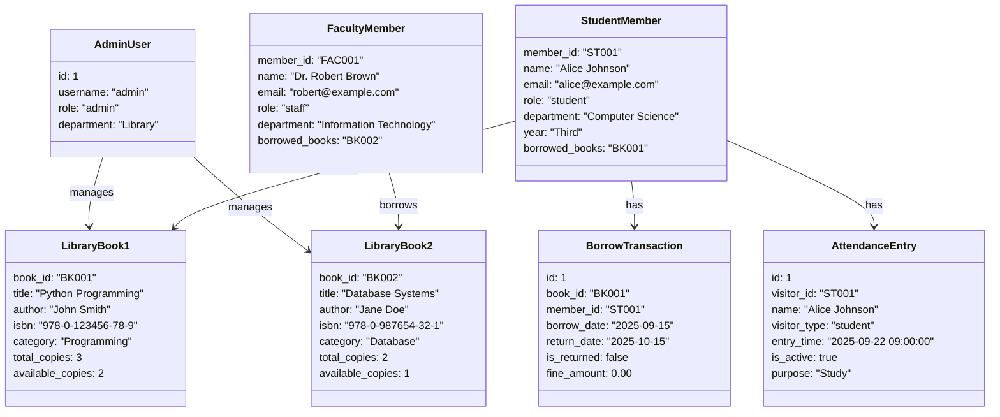

```mermaid
classDiagram
    %% Object instances of the Library Management System
    
    class AdminUser {
        id: 1
        username: "admin"
        role: "admin"
        department: "Library"
    }
    
    class LibraryBook1 {
        book_id: "BK001"
        title: "Python Programming"
        author: "John Smith"
        isbn: "978-0-123456-78-9"
        category: "Programming"
        total_copies: 3
        available_copies: 2
    }
    
    class LibraryBook2 {
        book_id: "BK002"
        title: "Database Systems"
        author: "Jane Doe"
        isbn: "978-0-987654-32-1"
        category: "Database"
        total_copies: 2
        available_copies: 1
    }
    
    class StudentMember {
        member_id: "ST001"
        name: "Alice Johnson"
        email: "alice@example.com"
        role: "student"
        department: "Computer Science"
        year: "Third"
        borrowed_books: "BK001"
    }
    
    class FacultyMember {
        member_id: "FAC001"
        name: "Dr. Robert Brown"
        email: "robert@example.com"
        role: "staff"
        department: "Information Technology"
        borrowed_books: "BK002"
    }
    
    class BorrowTransaction {
        id: 1
        book_id: "BK001"
        member_id: "ST001"
        borrow_date: "2025-09-15"
        return_date: "2025-10-15"
        is_returned: false
        fine_amount: 0.00
    }
    
    class AttendanceEntry {
        id: 1
        visitor_id: "ST001"
        name: "Alice Johnson"
        visitor_type: "student"
        entry_time: "2025-09-22 09:00:00"
        is_active: true
        purpose: "Study"
    }

    AdminUser --> LibraryBook1 : manages
    AdminUser --> LibraryBook2 : manages
    StudentMember --> LibraryBook1 : borrows
    FacultyMember --> LibraryBook2 : borrows
    StudentMember --> BorrowTransaction : has
    StudentMember --> AttendanceEntry : has
```